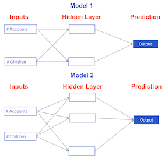

# Comparing neural network models to classical regression models #

Which of the models in the diagrams has greater ability to account for interactions?

## Answer: Model 2 ##

> Model 2 has more nodes in the hidden layer, and therefore, greater ability to capture interactions.