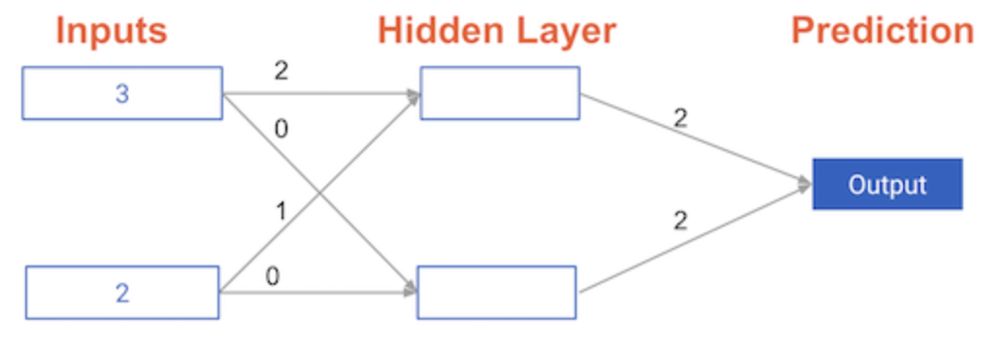

# Understanding how weights change model accuracy #

Imagine you have to make a prediction for a single data point. The actual value of the target is 7. The weight going from `node_0` to the `output` is 2, as shown below. If you increased it slightly, changing it to 2.01, would the predictions become more accurate, less accurate, or stay the same?

## Answer: Less accurate ##

> Increasing the weight to `2.01` would increase the resulting error from `9` to `9.08`, making the predictions less accurate.