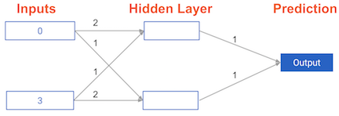

# Coding how weight changes affect accuracy #

Now you'll get to change weights in a real network and see how they affect model accuracy!

Have a look at the following neural network:<br>
<br>

Its weights have been pre-loaded as `weights_0`. Your task in this exercise is to update a single weight in `weights_0` to create `weights_1`, which gives a perfect prediction (in which the predicted value is equal to `target_actual`: 3).

Use a pen and paper if necessary to experiment with different combinations. You'll use the `predict_with_network()` function, which takes an array of data as the first argument, and weights as the second argument.

## Instructions ##

* Create a dictionary of weights called `weights_1` where you have changed `1` weight from `weights_0` (You only need to make 1 edit to `weights_0` to generate the perfect prediction).
* Obtain predictions with the new weights using the `predict_with_network()` function with `input_data` and `weights_1`.
* Calculate the error for the new weights by subtracting `target_actual` from `model_output_1`.

```python
# The data point you will make a prediction for
input_data = np.array([0, 3])

# Sample weights
weights_0 = {'node_0': [2, 1],
             'node_1': [1, 2],
             'output': [1, 1]
            }

# The actual target value, used to calculate the error
target_actual = 3

# Make prediction using original weights
model_output_0 = predict_with_network(input_data, weights_0)

# Calculate error: error_0
error_0 = model_output_0 - target_actual

# Create weights that cause the network to make perfect prediction (3): weights_1
weights_1 = {'node_0': [2, 1],
             'node_1': [1, 0],
             'output': [1, 1]
            }

# Make prediction using new weights: model_output_1
model_output_1 = predict_with_network(input_data, weights_1)

# Calculate error: error_1
error_1 = model_output_1 - target_actual

# Print error_0 and error_1
print(error_0)
print(error_1)
```
    6
    0

> Fantastic! The network now generates a perfect prediction with an error of 0.