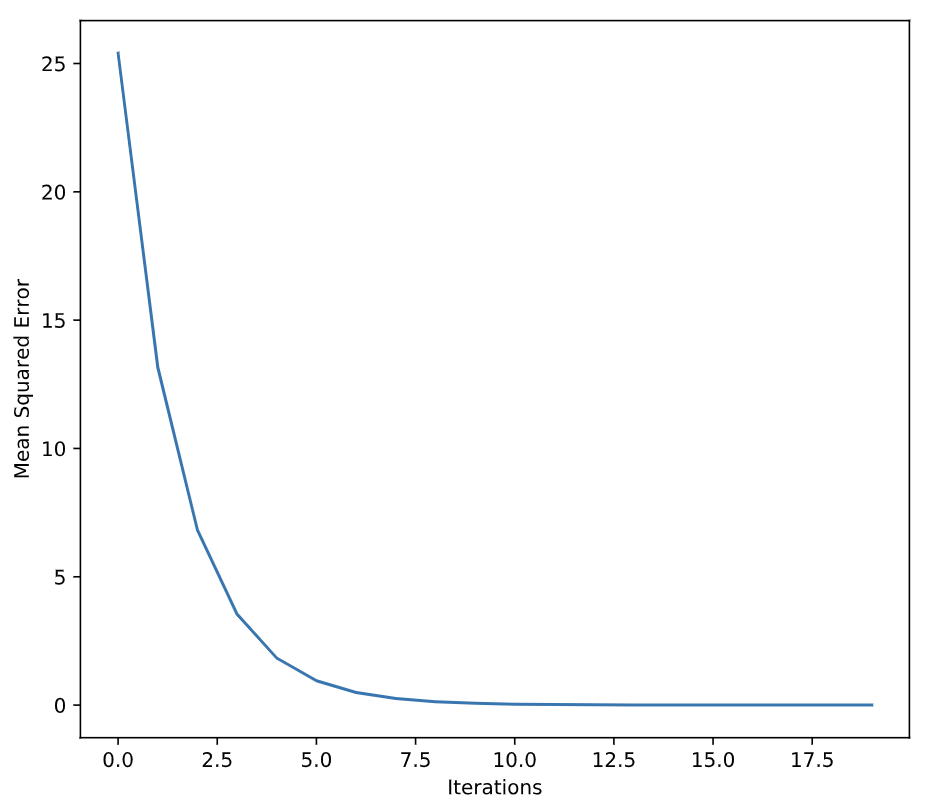

# Making multiple updates to weights #

You're now going to make multiple updates so you can dramatically improve your model weights, and see how the predictions improve with each update.

To keep your code clean, there is a pre-loaded `get_slope()` function that takes `input_data`, `target`, and `weights` as arguments. There is also a `get_mse()` function that takes the same arguments. The `input_data`, `target`, and `weights` have been pre-loaded.

This network does not have any hidden layers, and it goes directly from the input (with 3 nodes) to an output node. Note that weights is a single array.

We have also pre-loaded `matplotlib.pyplot`, and the error history will be plotted after you have done your gradient descent steps.

## Instructions ##

* Using a `for` loop to iteratively update weights:
   * Calculate the slope using the `get_slope()` function.
   * Update the weights using a learning rate of `0.01`.
   * Calculate the mean squared error (`mse`) with the updated weights using the `get_mse()` function.
   * Append `mse` to `mse_hist`.
* Hit 'Submit Answer' to visualize `mse_hist`. What trend do you notice?

```python
n_updates = 20
mse_hist = []

# Iterate over the number of updates
for i in range(n_updates):
    # Calculate the slope: slope
    slope = get_slope(input_data, target, weights)
    
    # Update the weights: weights
    weights = weights - 0.01 * slope
    
    # Calculate mse with new weights: mse
    mse = get_mse(input_data, target, weights)
    
    # Append the mse to mse_hist
    mse_hist.append(mse)

# Plot the mse history
plt.plot(mse_hist)
plt.xlabel('Iterations')
plt.ylabel('Mean Squared Error')
plt.show()
```



> As you can see, the mean squared error decreases as the number of iterations go up.