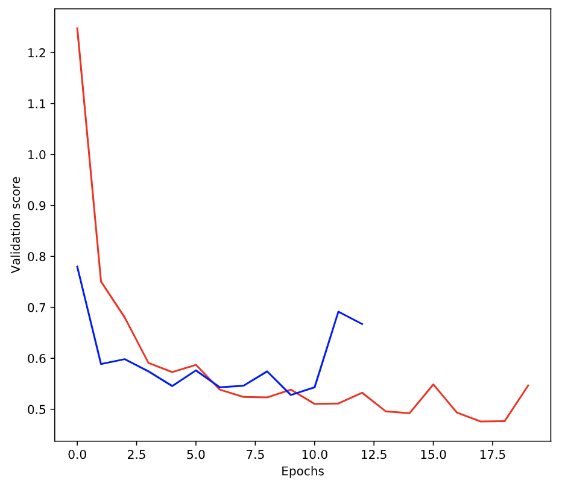

# Adding layers to a network #

You've seen how to experiment with wider networks. In this exercise, you'll try a deeper network (more hidden layers).

Once again, you have a baseline model called `model_1` as a starting point. It has 1 hidden layer, with `50` units. You can see a summary of that model's structure printed out. You will create a similar network with 3 hidden layers (still keeping 50 units in each layer).

This will again take a moment to fit both models, so you'll need to wait a few seconds to see the results after you run your code.

## Instructions ##

* Specify a model called `model_2` that is like `model_1`, but which has 3 hidden layers of 50 units instead of only 1 hidden layer.
   * Use `input_shape` to specify the input shape in the first hidden layer.
   * Use `'relu'` activation for the 3 hidden layers and `'softmax'` for the output layer, which should have 2 units.
* Compile `model_2` as you have done with previous models: Using `'adam'` as the `optimizer`, `'categorical_crossentropy'` for the `loss`, and `metrics=['accuracy']`.
* Hit 'Submit Answer' to fit both the models and visualize which one gives better results! For both models, you should look for the best `val_loss` and `val_acc`, which won't be the last epoch for that model.

```
_________________________________________________________________
Layer (type)                 Output Shape              Param #   
=================================================================
dense_1 (Dense)              (None, 50)                550       
_________________________________________________________________
dense_2 (Dense)              (None, 2)                 102       
=================================================================
Total params: 652.0
Trainable params: 652
Non-trainable params: 0.0
_________________________________________________________________
None
```

```python
# The input shape to use in the first hidden layer
input_shape = (n_cols,)

# Create the new model: model_2
model_2 = Sequential()

# Add the first, second, and third hidden layers
model_2.add(Dense(50, activation='relu', input_shape=input_shape))
model_2.add(Dense(50, activation='relu'))
model_2.add(Dense(50, activation='relu'))

# Add the output layer
model_2.add(Dense(2, activation='softmax'))

# Compile model_2
model_2.compile(optimizer='adam', loss='categorical_crossentropy', metrics=['accuracy'])

# Fit model 1
model_1_training = model_1.fit(predictors, target, epochs=20, validation_split=0.4, callbacks=[early_stopping_monitor], verbose=False)

# Fit model 2
model_2_training = model_2.fit(predictors, target, epochs=20, validation_split=0.4, callbacks=[early_stopping_monitor], verbose=False)

# Create the plot
plt.plot(model_1_training.history['val_loss'], 'r', model_2_training.history['val_loss'], 'b')
plt.xlabel('Epochs')
plt.ylabel('Validation score')
plt.show()
```



> The blue model is the one you made and the red is the original model. The model with the lower loss value is the better model.